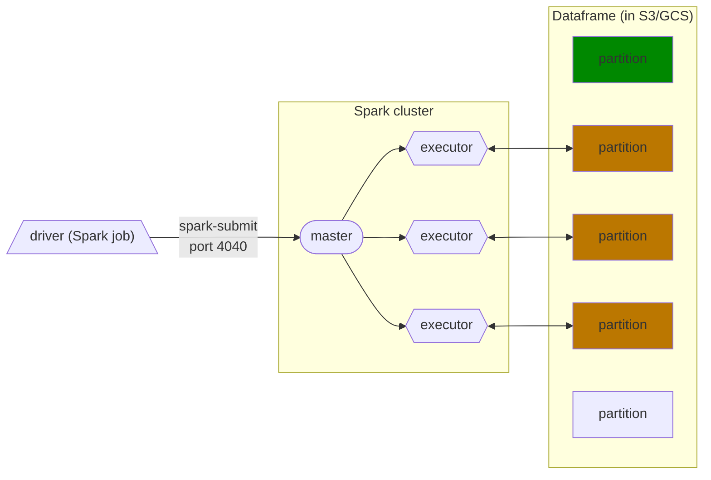
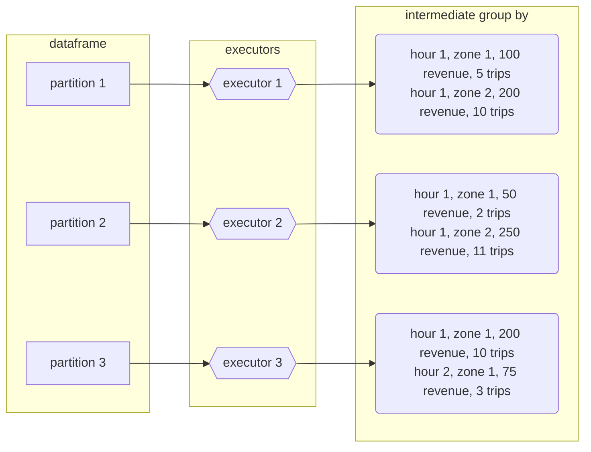
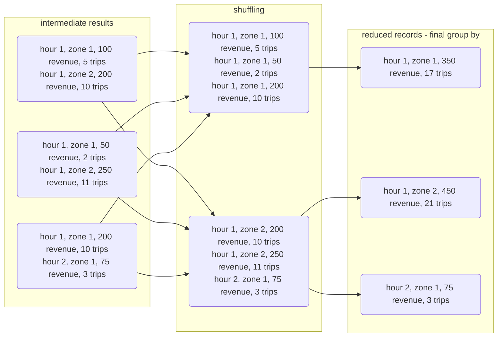
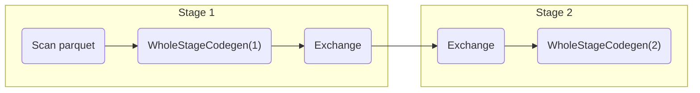
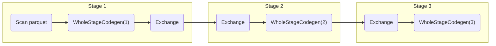

# Spark Internals

## Anatomy of a Spark Cluster
	Spark Cluster, Spark Driver, Master, and Executors

In spark, when we set `.master()` to `local[*]`, it creates a `local cluster`



Usually, the way it works is as follows:
1. We create a script in `python` or `scala` with some spark code on our laptop, or in Airflow for example
2. We have an independent Spark cluster.
	- In here we have a computer or a node that we will call `spark master`
	- The role of `spark master` is to coordinate jobs
3. We submit our code to this `spark cluster` and to the `spark master`
	- We use `spark-submit` to sent the package with our code to the master and we specify some information such as: 
		- What are the resources we need to do this job for example
4. In the `spark cluster` we have computers or nodes known as `executors` which do the actual computations
5. Each executor will fetch a dataframe partition stored in a Data Lake (usually S3, GCS or a similar cloud provider), do something with it and then store it somewhere, which could be the same Data Lake or somewhere else. If there are more partitions than executors, executors will keep fetching partitions until every single one has been processed.
6. This is in contrast to Hadoop, another data analytics engine, whose executors locally store the data they process. Partitions in Hadoop are duplicated across several executors for redundancy, in case an executor fails for whatever reason (Hadoop is meant for clusters made of commodity hardware computers). However, data locality has become less important as storage and data transfer costs have dramatically decreased and nowadays it's feasible to separate storage from computation, so Hadoop has fallen out of fashion.
7. Today, since most big data is in the cloud, and the `spark cluster` is also usually in the same data center, so downloading the data required is fast. 
8. The prefered way is to keep the data in S3 or GCS, have a `spark cluster` and then do our big data work that way

There is a `driver`	that submits the code to the `spark master` in a `spark cluster`


## GroupBy in Spark

The query we will be using as an example will be the following: 

```python
df_green_revenue = spark.sql("""
SELECT 
    date_trunc('hour', lpep_pickup_datetime) AS hour, 
    PULocationID AS zone,
    SUM(total_amount) AS amount,
    COUNT(1) AS number_records
FROM
    green
WHERE
    lpep_pickup_datetime >= '2020-01-01 00:00:00'
GROUP BY
    1, 2  
""")
```

This query will output the total revenue and amount of trips per hour per zone. We need to group by hour and zones in order to do this

Since the data is split along partitions, it's likely that we will need to group data which is in separate partitions, but executors only deal with individual partitions. Spark solves this issue by separating the grouping in 2 stages:

1. In the first stage, each executor groups the results in the partition they're working on and outputs the results to a temporary partition. These temporary partitions are the ***intermediate results***.
	* `Executors` in `spark` can only process one partition at a time



2. The second stage ***shuffles*** the data, and in this case is also known as ***reshuffling***: Spark will put all records with the ***same keys*** (in this case, the `GROUP BY` keys which are hour and zone) in the ***same partition***. The algorithm to do this is called _external merge sort_. Once the shuffling has finished, we can once again apply the `GROUP BY` to these new partitions and ***reduce*** the records to the ***final output***.
    * Note that the shuffled partitions may contain more than one key, but all records belonging to a key should end up in the same partition.



Running the query should display the following DAG in the Spark UI:


* The `Exchange` task refers to the shuffling.

If we were to add sorting to the query (adding a `ORDER BY 1,2` at the end), Spark would perform a very similar operation to `GROUP BY` after grouping the data. The resulting DAG would look liked this:



By default, Spark will repartition the dataframe to 200 partitions after shuffling data. For the kind of data we're dealing with in this example this could be counterproductive because of the small size of each partition/file, but for larger datasets this is fine.

Shuffling is an ***expensive operation***, so it's in our best interest to reduce the amount of data to shuffle when querying.
* Keep in mind that repartitioning also involves shuffling data.


## Joins in Spark

