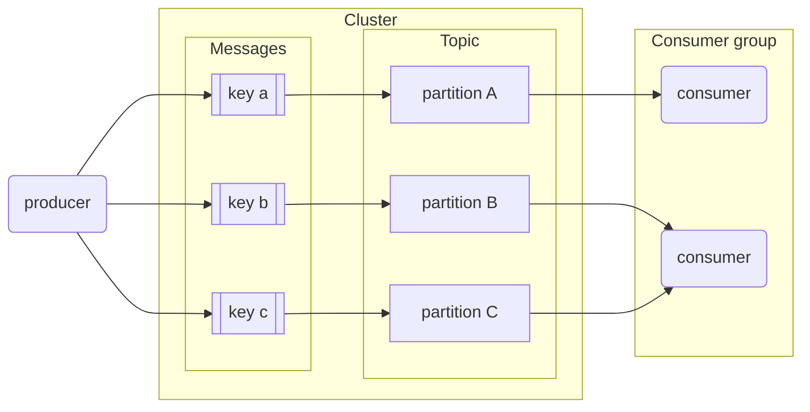

# Kafka Introduction

## What is Kafka
	Apache Kafka is a message broker and stream processor. Kafka is used to handle real-time data feeds.

Before Kafka, the general architecture would look something like this: 
```
Top: Set of consumers such as Web, Apps, Analytics, Microservices and more

Bottom: Set of data sources or sinks or databases
```
In a data project we can differentiate between consumers and producers:
- Consumers are those that consume the data: web pages, micro services, apps, etc.
- Producers are those who supply the data to consumers.

For example, a web-service is pulling data from a `cache` and pushing the data to a logging service/database. 
The logs are then read by the some microservices and also maybe by monitoring services.

The whole architecture diagram for all this to happen becomes complicated really quickly as many different components such as logging, noSQL, and hadoop are talking to multiple consumers and producers
And this becomes difficult to maintain overtime.

Now, with the introduction of Kafka, the architecture would look something like this:
```
Top: Set of consumers such as Web, Apps, Analytics, Microservices and more

Middle: Apache Kafka

Bottom: Set of data sources or sinks or databases
```

In this case, when our web app produces a message, this message can be directly read by a microservice or a monitoring service from Apache Kafka

Connecting consumers to producers directly can lead to an amorphous and hard to maintain architecture in complex projects like the one in the first image. Kafka solves this issue by becoming an intermediary that all other components connect to.

Kafka works by allowing producers to send messages which are then pushed in real time by Kafka to consumers.
- We can think of Kafka as a message broker or a message service between the data producers and consumers

Kafka is hugely popular and most technology-related companies use it.

## Basic Kafka Components

### Message
The basic communication abstraction used by producers and consumers in order to share information in Kafka is called a message.

Generally, when we are talking about pushing data to Kafka or talking between producers and consumers, this happens over the abstraction called `Messages` in Kafka

**Messages** have 3 main components:

- ***Key***: used to identify the message and for additional Kafka stuff such as partitions, and which direction or which partition this message will go into (covered later).
- ***Value***: the actual information that producers push and consumers are interested in.
- ***Timestamp***: used for logging. Can be put by a producer or a consumer

### Topic

A ***topic*** is an abstraction of a concept. Concepts can be anything that makes sense in the context of the project, such as "sales data", "new members", "clicks on banner", etc.

For example, we can have `topic` for `click data` in which there will click related data. And producers will push click related data to this topic, and consumers will consume click related data from this topic
- The idea is that each `concept` has its own `topic`

A **producer** pushes a message to a topic, which is then consumed by a **consumer** subscribed to that topic.

### Broker and Cluster

A ***Kafka broker*** is a machine (physical or virtualized) on which Kafka is running.

A ***Kafka cluster*** is a collection of brokers (nodes) working together.

### Logs

In Kafka, ***logs*** are _data segments_ present on a storage disk. In other words, they're _physical representations of data_.

***Logs*** store messages in an ordered fashion. Kafka assigns a sequence ID in order to each new message and then stores it in logs.
- ***Logs*** help us to keep and store our data in Kafka

### Intermission: visualizing the concepts so far

Here's how a producer and a consumer would talk to the same Kafka broker to send and receive messages.

* Producer sending messages to Kafka.
    ```mermaid
    flowchart LR
        p(producer)
        k{{kafka broker}}
        subgraph logs[logs for topic 'abc']
            m1[message 1]
            m2[message 2]
            m3[message 3]
        end
        p-->|1. Declare topic 'abc'|k
        p-->|2. Send messages 1,2,3|k
        k -->|3. Write messages 1,2,3|logs
        k-.->|4. ack|p
    ```
    1. The producer first declares the topic it wants to "talk about" to Kafka. In this example, the topic will be `abc`. Kafka will then assign a _physical location_ on the hard drive for that specific topic (the topic logs).
    1. The producer then sends messages to Kafka (in our example, messages 1, 2 and 3).
    1. Kafka assigns an ID to the messages and writes them to the logs.
    1. Kafka sends an acknowledgement to the producer, informing it that the messages were successfully sent and written.

* Consumer receiving messages
    * Broker and logs are the same as those in the first graph; the graph has been split in 2 for clarity.
    ```mermaid
    flowchart LR
        c(consumer)
        k{{kafka broker}}
        subgraph logs[logs for topic 'abc']
            m1[message 1]
            m2[message 2]
            m3[message 3]
        end
        c-->|1. Subscribe to topic 'abc|k
        k<-->|2. Check messages|logs
        k-->|3. Send unread messages|c
        c-.->|4. ack|k
    ```
    1. The consumer declares to Kafka that it wants to read from a particular topic. In our example, the topic is `abc`.
    1. Kafka checks the logs and figures out which messages for that topic have been read and which ones are unread.
    1. Kafka sends the unread messages to the consumer.
    1. The consumer sends an acknowledgement to Kafka, informint it that the messages were successfully received.

### `__consumer_offsets`
	This is considered as an Internal Topic in Kafka

The workflows work fine for a single consumer but it omits how it keeps track of read messages. It also doesn't show what would happen if 2 or more consumers are consuming messages for the same topic.

***`__consumer_offsets`*** is a special topic that keeps track of messages read by each consumer and topic. In other words: _Kafka uses itself_ to keep track of what consumers do.

When a consumer reads messages and Kafka receives the ack, Kafka posts a message to `__consumer_offsets` with the consumer ID, the topic and the message IDs that the consumer has read. If the consumer dies and spawns again, Kafka will know the last message delivered to it in order to resume sending new ones. If multiple consumers are present, Kafka knows which consumers have read which messages, so a message that has been read by consumer #1 but not by #2 can still be sent to #2.

### Consumer Groups

A ***consumer group*** is composed of multiple consumers.

When we create a ***consumer*** application, we generally end up creating a ***consumer group*** as well, and we specify a ***consumer group ID*** with it. 

In regards of controlling read messages, Kafka treats all the consumers inside a consumer group as a _single entity_: when a consumer inside a group reads a message, that message will ***NOT*** be delivered to any other consumer in the group.

Consumer groups allow consumer apps to scale independently: a consumer app made of multiple consumer nodes will not have to deal with duplicated or redundant messages.

Consumer groups have IDs and all consumers within a group have IDs as well.

The default value for consumer groups is 1. All consumers belong to a consumer group.

Advantages of Consumer Groups
- Tells Kafka that all the consumers in a particular group are only one entity, and as a result Kafka treats them as one entity
	- Treats all the Consumers in a Consumer Group as one Consumer consuming message from a particular Topic
- If Consumer One receives a message and acknowledges it, then Consumer Two will not get the same message
	- And at the same time Consumer Two can be receiving another message from the same Topic and so on
- This is beneficial for us as we can scale inside the consumer group
	- We are able to scale our consumer application horizontally

### Partitions
	
>Note: do not confuse BigQuery or Spark partitions with Kafka partitions; they are different concepts.

`Partitioning` in `Kafka` is used for ***scalability*** purposes

Topic logs in Kafka can be ***partitioned***. A topic is essentially a _wrapper_ around (different partitions) at least 1 partition.

Partitions are assigned to consumers inside consumer groups:
* ***A partition*** is assigned to ***one consumer only***.
* ***One consumer*** may have ***multiple partitions*** assigned to it.
* If a consumer dies, the partition is reassigned to another consumer.
* Ideally there should be as many partitions as consumers in the consumer group.
    * If there are more partitions than consumers, some consumers will receive messages from multiple partitions.
    * If there are more consumers than partitions, the extra consumers will be idle with nothing to do.

Partitions in Kafka, along with consumer groups, are a scalability feature. Increasing the amount of partitions allows the consumer group to increase the amount of consumers in order to read messages at a faster rate. Partitions for one topic may be stored in separate Kafka brokers in our cluster as well.

Messages are assigned to partitions inside a topic by means of their ***key***: message keys are hashed and the hashes are then divided by the amount of partitions for that topic; the remainder of the division is determined to assign it to its partition. In other words: _hash modulo partition amount_.
* While it would be possible to store messages in different partitions in a round-robin way, this method would not keep track of the _message order_.
* Using keys for assigning messages to partitions has the risk of making some partitions bigger than others. For example, if the topic `client` makes use of client IDs as message keys and one client is much more active than the others, then the partition assigned to that client will grow more than the others. In practice however this is not an issue and the advantages outweight the cons.



### Replication
	Helps us in fault tolerance in Kafka


Partitions are ***replicated*** across multiple brokers in the Kafka cluster as a fault tolerance precaution.

When a partition is replicated across multiple brokers, one of the brokers becomes the ***leader*** for that specific partition. The leader handles the message and writes it to its partition log. The partition log is then replicated to other brokers, which contain ***replicas*** for that partition. Replica partitions should contain the same messages as leader partitions.

If a broker which contains a leader partition dies, another broker becomes the leader and picks up where the dead broker left off, thus guaranteeing that both producers and consumers can keep posting and reading messages.

When a `message` is being written to a particular partition or a `topic`, it is also being replicated across different brokers in a Kafka Cluster. 
- This is done so that if Broker 0 (leader for partition 0) dies, Broker 1 (leader for partition 1) can then act as the leader for partition 0
- And consumers and producers can continue consuming and producing to and from the topic 

We can define the _replication factor_ of partitions at topic level. A replication factor of 1 (no replicas) is undesirable, because if the leader broker dies, then the partition becomes unavailable to the whole system, which could be catastrophic in certain applications.

