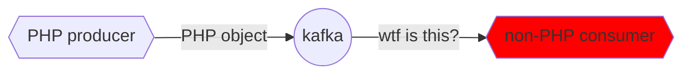
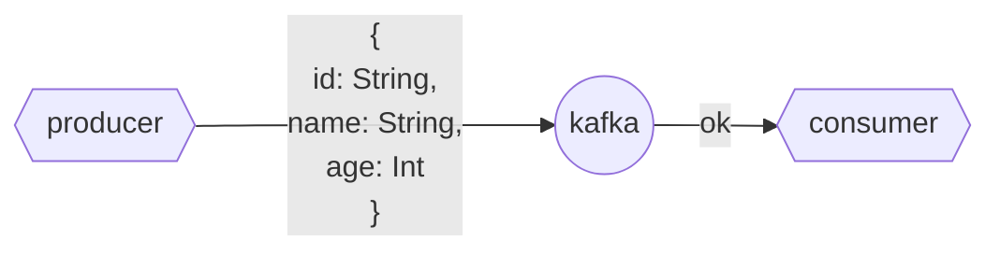
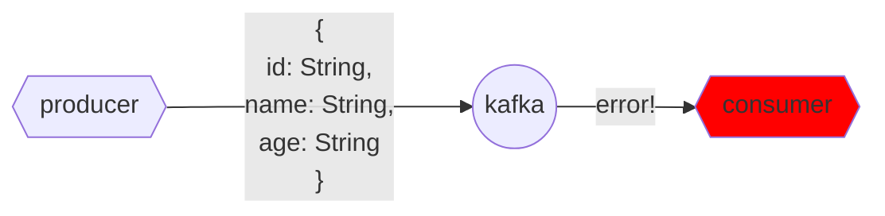
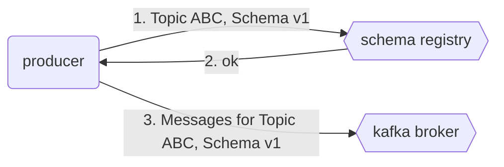
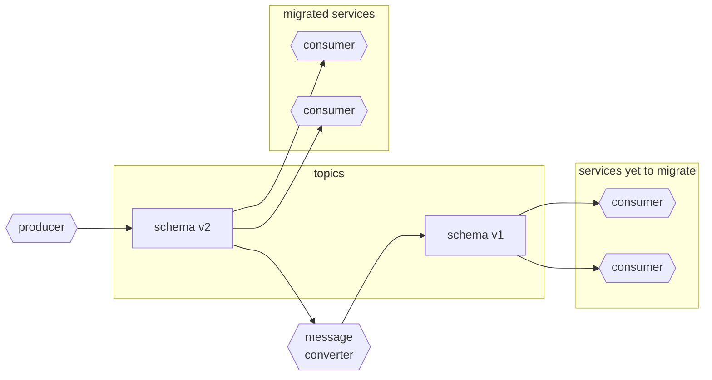

# Avro and Schema Registry

## Why are schemas needed?

Kafka messages can be anything, from plain text to binary objects. This makes Kafka very flexible but it can lead to situations where consumers can't understand messages from certain producers because of incompatibility (like a producer sending a PHP object to a Python consumer).



In order to solve this, we can introduce a ***schema*** to the data so that producers can define the kind of data they're pushing and consumers can understand it.

## What is Avro

***[Avro](https://avro.apache.org/)*** is a ***data serialization system*** .
    * [Serialization](https://www.wikiwand.com/en/Serialization) is transforming a data structure or object into a structure that can be stored or transmitted.

Unlike other serialization systems such as [Protobuf](https://developers.google.com/protocol-buffers) or [JSON](https://www.json.org/json-en.html), ***Avro*** stores the ***schema separated from the record***. You need a separate Avro schema in order to read an Avro record.

***Records*** in Avro are stored using ***binary encoding*** and schemas are defined with JSON or [IDL](https://avro.apache.org/docs/1.8.1/idl.html).

These features result in 3 main advantages:
* ***Smaller record filesize*** compared to other formats such as JSON.
* ***Schema evolution***: you can evolve the schema overtime without breaking the consumers.
* Avro clients provide ***automatic validation*** against schemas. If you try to push an incompatible schema between versions, the Kafka Avro client will not allow you to do so.

Avro is supported by Kafka. Protobuf is also supported but we will focus on Avro for this lesson.

## Why Schema Compatibility

Let's supose that we use JSON instead of Avro for serializing data and sending messages.



Because the schema is implicit in JSON, the consumer has to assume that `id` and `name` will be strings and `age` is an integer. Let's say that for whatever reason we need to update the schema and change `age` to a String as well:



If we haven't updated the consumer to understand the new schema, then the consumer will be unable to parse the message because it's expecting an integer rather than a string. In distributed systems where we do not have 100% certainty of who the consumer for the data will be, we cannot afford producing incompatible messages.

We can think of the _relationship_ between producers and consumers as a ***contract***: both parts agree to communicate according to a standard and it's imperative that the contract is maintained.  If the contract needs updating, then it's best to do so without explicitly "talking" to them (modifying each individual part), instead we could have a system that automatically validates this contract and keep it updated.

A ***schema registry*** is such a system. The schema registry contains the schemas we define for our messages. Avro fetches the schema for each message and validates that any changes to the schema registry are compatible with previous versions.

## Avro schema evolution

We can define 3 different kinds of evolutions for schemas:
* ***Backward compatibility***: producers using older schemas generate messages that can be read by consumers using newer schemas.
* ***Forward compatibility***: producers using newer schemas generate messages that can be read by consumers using older schemas.
    * Consumers can read all records in the topic.
* ***Mixed/hybrid versions***: ideal condition where schemas are both forward and backward compatible.


## Schema registry

The ***schema registry*** is a component that stores schemas and can be accessed by both producers and consumers to fetch them.

Schema Registry prevents us from publishing any messages to Kafka which might not be compatible overtime

This is the usual workflow of a working schema registry with Kafka:


1. The producer checks with the schema registry, informing it that it wants to post to topic ABC with schema v1.
2. The registry checks the schema.
    * If no schema exists for the topic, it registers the schema and gives the ok to the producer.
    * If a schema already exists for the topic, the registry checks the compatibility with both the producer's and the registered schemas.
        * If the compatibility check is successful, the registry sends a message back to the producer giving the OK to start posting messages.
        * If the check fails, the registry tells the producer that the schema is incompatible and the producer returns an error.
3. The producer starts sending messages to the ABC topic using the v1 schema to a Kafka broker.

When the consumer wants to consume from a topic, it checks with the schema registry which version to use. If there are multiple schema versions and they're all compatible, then the consumer could use a different schema than the producer.

## Schema registry

The ***schema registry*** is a component that stores schemas and can be accessed by both producers and consumers to fetch them.

This is the usual workflow of a working schema registry with Kafka:


1. The producer checks with the schema registry, informing it that it wants to post to topic ABC with schema v1.
2. The registry checks the schema.
    * If no schema exists for the topic, it registers the schema and gives the ok to the producer.
    * If a schema already exists for the topic, the registry checks the compatibility with both the producer's and the registered schemas.
        * If the compatibility check is successful, the registry sends a message back to the producer giving the OK to start posting messages.
        * If the check fails, the registry tells the producer that the schema is incompatible and the producer returns an error.
3. The producer starts sending messages to the ABC topic using the v1 schema to a Kafka broker.

When the consumer wants to consume from a topic, it checks with the schema registry which version to use. If there are multiple schema versions and they're all compatible, then the consumer could use a different schema than the producer.

Avro does not hard code which schema is to be used for deserialization. So if multiople schemas are compatible, schema 1 can be used to deserialize a message with schema 2 for example. 


## Dealing with incompatible schemas

There are instances in which schemas must be updated in ways that break compatibility with previous ones.

In those cases, the best way to proceed is to create a new topic for the new schema and add a downstream service that converts messages from the new schema to the old one and publishes the converted messages to the original topic. This will create a window in which services can be migrated to use the new topic progressively.



## Avro demo

We will now create a demo in which we will see a schema registry and Avro in action.

### `docker-compose.yml`

In the [docker compose file we used in the previous demo](../docker-compose.yml) there's a `schema-registry` service that uses [Confluent's Schema Registry](https://docs.confluent.io/platform/current/schema-registry/). The docker container will run locally and bind to port 8081, which we will make use of in the following scripts.

### Defining schemas

Schemas are defined using JSON syntax and saved to `asvc` files. We will define 2 schemas: a schema for the ***message key*** and another for the ***message value***.

* The ***message key schema*** contains basic info that allows us to identify the message. You can download the complete `taxi_ride_key.avsc` file [from this link](../avro/taxi_ride_key.avsc).
    ```json
    {
        "namespace": "com.datatalksclub.taxi",
        "type": "record",
        "name": "TaxiRideKey",
        "fields": [
            {
                "name": "vendorId",
                "type": "int"
            }
        ]
    }
    ```
* The ***message value schema*** defines the schema of the actual info we will be sending. For this example, we have created a `taxi_ride_value.avsc` file that you can download [from this link](../avro/taxi_ride_value.avsc) which contains a few primitive data types.
    * This schema is to be used with [the `rides.csv` file](../avro/data/rides.csv) which contains a few taxi rides already prepared for the example.

### Producer

We will create a [`producer.py` file](../avro/producer.py) that will do the following:
* Import the `avro` and `avroProducer` libraries from `confluent_kafka`.
* Define a `load_avro_schema_from_file()` function which reads the 2 schema files we defined above.
* In the main `send_record()` method:
    * We define both the kafka broker and the schema registry URLs as well as the `acks` behavior policy.
    * We instantiate an `AvroProducer` object.
    * We load the data from the CSV file.
    * We create both key and value dictionaries from each row in the CSV file.
    * For each key-value pair, we call the `AvroProducer.produce()` method which creates an Avro-serialized message and publishes it to Kafka using the provided topic (`datatalkclub.yellow_taxi_rides` in this example) in its arguments.
    * We catch the exceptions if sending messages fails, or we print a success message otherwise.
    * We flush and sleep for one second to make sure that no messages are queued and to force sending a new message each second.

### Consumer

We will also create a [`consumer.py` file](../avro/consumer.py) that will do the following:
* Imports `AvroConsumer` from `confluent_kafka.avro`.
* Defines the necessary consumer settings (kafka and registry URLs, consumer group id and auto offset reset policy).
* Instantiates an `AvroConsumer` object and subscribes to the `datatalkclub.yellow_taxi_rides` topic.
* We enter a loop in which every 5 milliseconds we poll the `AvroConsumer` object for messages. If we find a message, we print it and we _commit_ (because we haven't set autocommit like in the previous example).

### Run the demo

1. Run the `producer.py` script and on a separate terminal run the `consumer.py` script. You should see the messages printed in the consumer terminal with the schema we defined. Stop both scripts.
2. Modify the `taxi_ride_value.avsc` schema file and change a data type to a different one (for example, change `total_amount` from `float` to `string`). Save it.
3. Run the `producer.py` script again. You will see that it won't be able to create new messages because an exception is happening.

When `producer.py` first created the topic and provided a schema, the registry associated that schema with the topic. By changing the schema, when the producer tries to subscribe to the same topic, the registry detects an incompatiblity because the new schema contains a string, but the scripts explicitly uses a `float` in `total_amount`, so it cannot proceed.