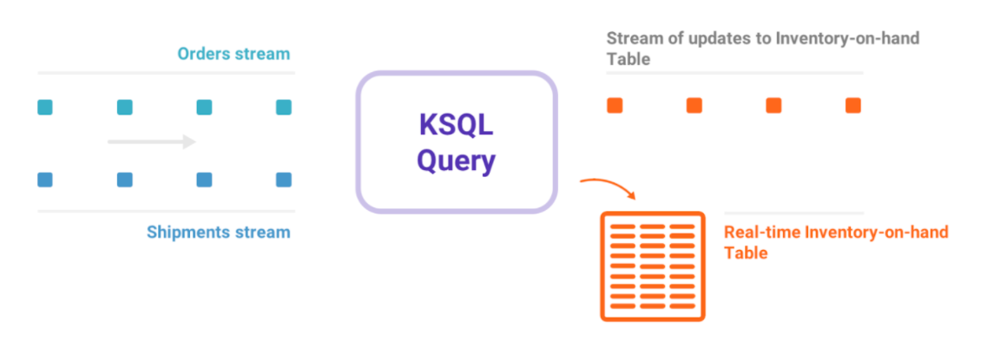

# Kafka Connect

[Kafka Connect](https://docs.confluent.io/platform/current/connect/index.html#:~:text=Kafka%20Connect%20is%20a%20free,Kafka%20Connect%20for%20Confluent%20Platform.) is a tool which allows us to stream data between external applications and services to/from Kafka. It works by defining ***connectors*** which external services connect to. Services from which data is pulled from are called ***sources*** and services which we send data to are called ***sinks***.

The biggest advantage of using Kafka Connect is that we do not really have to code anything and we can use existing connector and add our configuration for our use case. 

_[Back to the top](#)_

# KSQL

[KSQL](https://ksqldb.io/) is a tool for specifying stream transformations in SQL such as joins. The output of these transformations is a new topic.

KSQL offers consumers such as Data Scientists a tool for analyzing Kafka streams: instead of having to rely on Data Engineers to deliver consumable data to a Data Warehouse, Scientists can now directly query Kafka to generate consumable data on the fly.

However, KSQL isn't mature yet and lacks many useful features for Data Engineers (are the topics formatted with Avro, or are they JSON or just strings? How do you maintain the code? Do we need to manage a resource-intensive KSQL cluster just for occasional queries? etc.)